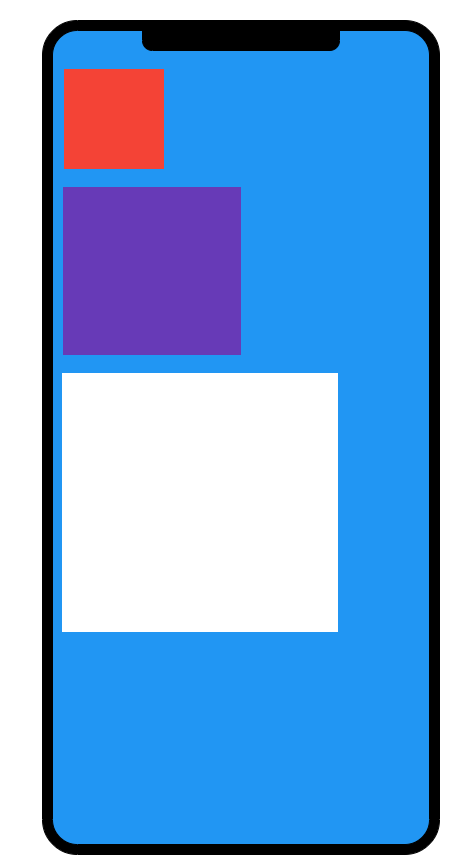
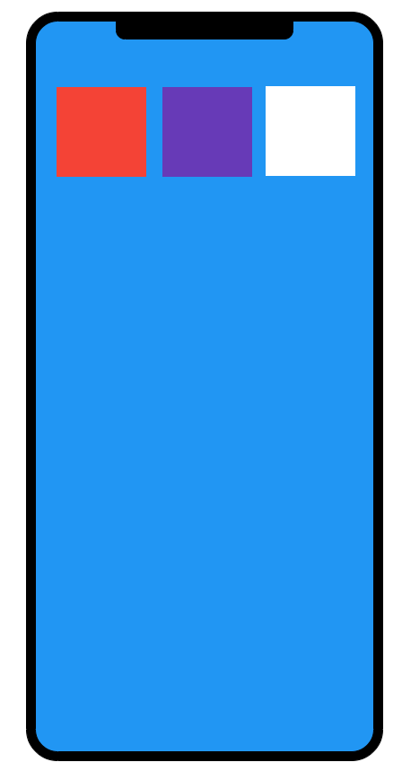
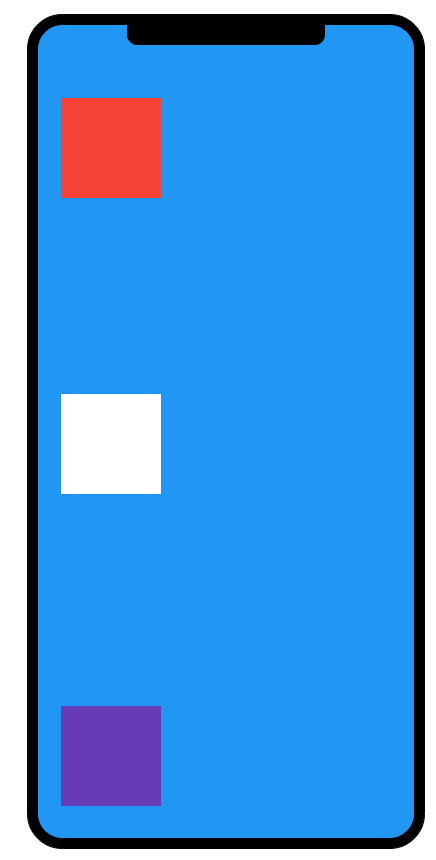
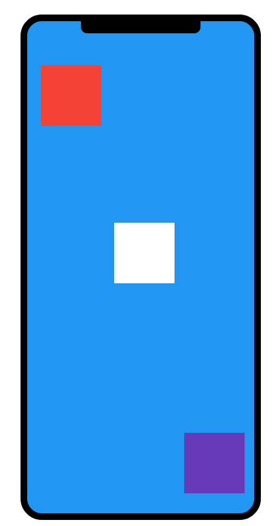
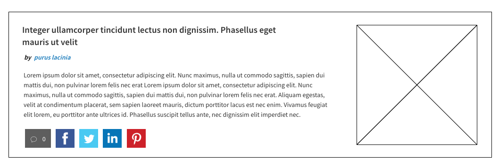
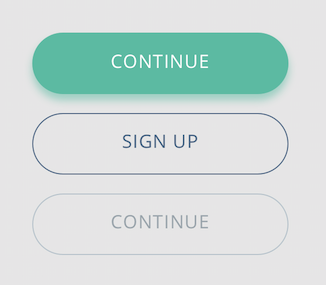

# React Native Training
An introduction to the React Native ecosystem, including reading sources, and a step by step learning process.  

## Objective
This workshop teaches the basics of React Native development. A participant of this course should end with the basic knowledge to be able to develop a mobile application following best practices.
The course is separated in different topics to guide the atendee to learn the basics of React Native, easing the learning curve.

At the end of this workshop, the atendee should be able to accomplish a final project consisting of a basic application, covering each of the previous topics.
 

##  Who Should Attend
The training will start at a low level, and does not require in depth knowledge of the platform in question. Desirable participant profile (basic knowledge): 

- HTML/XML
- CSS (with Flexbox)
- JavaScript
- Reusable components
- ES6 Modules
- React
- Redux

## Getting Started
Follow this course in a step by step manner. Each topic covers a specific matter of the React Native development process, and its completion is necessary to achieve the basic knowledge to develop the final project.

### Introduction
[React Native](https://facebook.github.io/react-native/) is a JavaScript platform that lets you build mobile applications. It's based on ReactJS, and it follows the same development principles. 

In the following chapters, you will learn how to install the necessary tools, and how to write and test your own native applications using React Native.

### Installation

There are several ways to build and run a React Native application. In this course we will use [Expo](https://expo.io/). Expo allows you to build the entire app without the need to install and configure neither XCode nor Android Studio.

First, install Expo (assuming you have [Node](https://nodejs.org/en/download/) installed)
```
npm install -g expo-cli
```
You can run your application in your own device, or deploy it in an emulator. 

To try the app in your device, download the Explo Client from the corresponding store.

[Expo Client for Android](https://play.google.com/store/apps/details?id=host.exp.exponent)

[Expo Client for iOS](https://itunes.apple.com/us/app/expo-client/id982107779?mt=8)

To test the application in an emulator, you will to install one.

To test in iOS, you will need the iOS Simulator from XCode (only available for MacOS) 

To test in Android, you will need either [Android Studio](https://developer.android.com/studio/) or [Genymotion](https://www.genymotion.com/fun-zone/). We reccomend Genymotion as it's the simpler and more lightweight option.

### Practice
Before starting with the different excercises, you will need to use a base, empty application. Inside the `training-playground` directory, there's a freshly created React Native app, auto-generated by the expo CLI, using
```
expo init training-playground
```
Go to the `training-playground` directory and install the necessary dependencies.

```
cd training-playground
npm install
```
Now you should be able to run the app by running

```
npm start
```

Now your application is ready to run either on your device or an emulator. Follow the instructions on the CLI or the browser tab to start to test.
#### Topic 1 - Core components

1) Instantiate a [View](https://facebook.github.io/react-native/docs/view) component and experiment changing it's size, border, background, etc.
2) Instantiate several View components, with different sizes and see what happens in different devices
3) Create a [ScrollView](https://facebook.github.io/react-native/docs/scrollview) to hold the created Views. Experiment with the `horizontal` prop. Try different heights and devices
4) Add text to the different Views through the [Text](https://facebook.github.io/react-native/docs/text) component. Apply different text sizes, font weights, and experiment with Text nesting.
5) Include an image inside a View with the [Image](https://facebook.github.io/react-native/docs/image) component. Try a local image, and a remote one. 
6) Make one of the images take the entire width of the container View.

#### Topic 2 - Styling and layout
Learn about creating different layouts with [Yoga](https://yogalayout.com/) and check the examples in
the [React Native Documentation](https://facebook.github.io/react-native/docs/style).


1) Create a new screen, in it's own separate directory and copy the followign layout. (Use a separate `styles.js` to hold the styles).
<p align="center">
  
</p>

2) Apply the same border radius to all three boxes. Try to reuse the border radius style.
3) Copy the following layouts by modifying the fixed widths. The boxes should take the entire height or width of the device in each case.
<p align="center">
  
  
</p> 

4) Make the first box take 50% of the device height, the second box take the 30%, and the third one the left 20%.
5) Copy the following layout (the white box is centered both vertically and horizontally)
<p align="center">
  
</p> 

6) Make the background color grey for iOS, and green for Android.
7)  Create a component to show a single article, like the following wireframe.
<p align="center">
  
</p> 

#### Topic 3 - Handling Events
Learn about how React Native handles [keyboard events](https://facebook.github.io/react-native/docs/handling-text-input)
and [touches](https://facebook.github.io/react-native/docs/handling-touches).

1) Create a new screen and add a `TextInput`. Each time the value changes, save it in the screen componente state.
2) Add a `TouchableOpacity` component to clear the `TextInput` on touch.
3) Create a custom `AppTextInput` component that represents a text input element. It should take a `type` prop that let's you change the behavior of the input. 
The default value for the `type` prop is "text", and it represents a normal text input. The prop could also receive a value of "password". In that case, it should
add the ability to hide/show the content of the input.
4) Take the `TouchableOpacity` instantiated for exercise 2, and wrap it in a new component. This component
should accept a `type` prop with two possible values: "primary" and "secondary". It will also accept a `disabled` prop.
If disabled, the button should not trigger any action. Follow the next design.
<p align="center">
  
</p> 

#### Topic 4 - Navigation
Learn about [React Navigation](https://reactnavigation.org/). Identify the different ways in which navigation is 
accomplished in mobile applications.

1) Install [react-navigation](https://reactnavigation.org/)
2) Create a new screen in it's own separate file.
3) Add a `TabNavigator` to the application. Add two tabs, the first one should render the screen you have been working on,
the second one should render a new one.
4) Change the tab labels. The first one should be 'Forms', the second one 'Other'. Add icons to both tab labels.
5) Create two new screens, called Forms2 and Forms3. Add a `StackNavigator` containing these new screens, and the Forms screen.
6) Add to the Forms screen the button you created for Topic 2 with the text "Next". When clicked, navigate to Forms2. Do the same for Forms, but navigating to Forms3.
7) Add a button to Forms3 with the text "Finish". When clicked, go back to the first Forms screen.
 
#### Topic 5 - Networking
Read about how React Native manages HTTP requests [here](https://facebook.github.io/react-native/docs/network).
1) Change the name of the Forms2 screen to "Posts". Consume this endpoint 
   ````
   https://jsonplaceholder.typicode.com/posts
   ````
   to get a list of sample posts. Show a list containing all posts, rendering the title and the body of each one of them. (Analize 
   the best option to show a scrollable list).
2) Show a spinner while the request is in progress (check what React Native provides for this scenario).
3) Change the name of the Forms3 screen to "Post". When touched on a post of the list, navigate to the "Post" screen
   and show that single post. 
4) In the "Post" screen, add information about the user that created it. Use the following endpoint to get that information
   ````
   https://jsonplaceholder.typicode.com/users
   ```` 


#### Topic 6 - Leveraging Native features
Learn what it is and how to add native capabilities to a React Native applications. Check instructions 
for the [automatic linking](https://facebook.github.io/react-native/docs/linking-libraries-ios).

1) Change the Tab label "Other" to "Camera". Create a new screen, and add both screens in this tab to a Stack
   (just like you did for the first tab).
2) Install and link [react-native-camera](https://github.com/react-native-community/react-native-camera) to supoort the picture taking feature.
   Inspect what files in the project have changed to better understand the linking process.
3) In the first screen of the "Camera" tab, open the camera and add the ability to take a picture.
4) In the second screen, whenever a picture is taken, show the picture. Add a button to
   go back to the camera screen. 

### Final Project (WIP)

The following is a sample project to put to practice all the topics learned so far. The definitions and functionalities are provided in a close to reality fashion. 
You will be provided with a list of features that the sample applications must have, along with a set of wireframes to guide how the app should look like. 
To accomplish the desired features, you will need to consume different services to get the data needed to populate the  views

Please, use this repository as a base for your workshop phase. The idea is to fork this project so everyone uses the same folder structure for the workshop.

Follow the next steps: 

1. Run `git clone https://github.com/van1985/workshop-rn.git`
2. Enter workshop-rn folder: `cd workshop-rn`
3. Enter redux-boilerplate folder: `cd redux-boilerplate`
4. Run `npm install`
5. open an emulator (android or iOS - from android studio, xCode , genymotion)
6. Run `npm start` (and choose 'a' for android or 'i' for iOS emulator)
7. Enjoy

#### Wireframes

##### Home

<p align="center">
  
</p>

##### Twitter Details

<p align="center">
  
</p>

##### Search & Trends

<p align="center">
  
</p>
<p align="center">
  
</p>

##### Configuration

<p align="center">
  
</p>


#### Stories

1. As a user, I want to see my twitter timeline.

2. As a user, I want to see my twitter timele (with infinite scroll).

3. As a user, I want to see a specific twitter details.

4. As a user, I want to see my country trends.

5. As a user, I want to search on twitter to quickly find news and events.

6. As a user, I want to see all the results for a specific search (with infinite scroll).

7. As a user, I want to configure what I want to see in my twitter timeline. This configuration must be reflected in the home section.

8. As a user, I want to use the app in Android & iOS Platform

#### Some tips...

* Use flatlist component for develop the different lists.
* Use ActivityIndicator for develop loading component. Make a specific component, so you can reuse it. 
* Use propTypes property for typechecking on the props for a component.
* Use the _base.js file to save all colors and attributes that are cross to the application.
 
#### Set Up Twitter Server

1. Open the console
2. Enter inside `server` folder
3. Execute the command `node server` in the console
3. Open the browser and type `localhost:8080`
4. Should see this text on the brower `Twitter API is running...`

#### Endpoints

#### GET statuses / home_timeline

endpoint: /timeline?count=100

Returns a collection of the most recent Tweets posted by the authenticating user and the users they follow.

##### Parameters

**count (optional)**: Specifies the number of records to retrieve. Must be less than or equal to 200. Defaults to 20. The value of count is best thought of as a limit to the number of tweets to return because suspended or deleted content is removed after the count has been applied.

#### GET trends/place

endpoint: /trends?id=23424747

Returns the top 50 trending topics for a specific WOEID, if trending information is available for it.

##### Parameters

**id (required)**: The Yahoo! Where On Earth ID of the location to return trending information for. Global information is available by using 1 as the WOEID .

#### GET search/tweets

endpoint: /search?q=TanBionicaCocaColaFM

Returns a collection of relevant Tweets matching a specified query.. This search API searches against a sampling of recent Tweets published in the past 7 days. Part of the 'public' set of APIs.

##### Parameters

**q (required)**: A UTF-8, URL-encoded search query of 500 characters maximum, including operators. Queries may additionally be limited by complexity.

#### GET statuses/show/:id

endpoint: show?id=1011417658833551361 (id_str)

Returns a single Tweet, specified by the id parameter. The Tweet’s author will also be embedded within the Tweet.

##### Parameters

**id** (required): The numerical ID of the desired Tweet.
